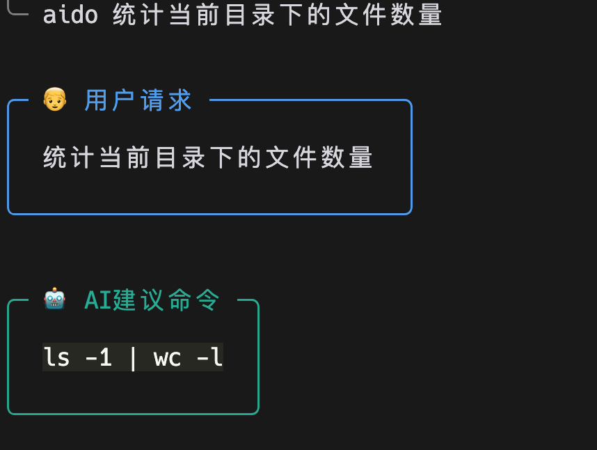
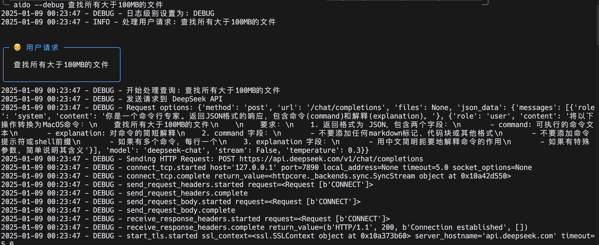
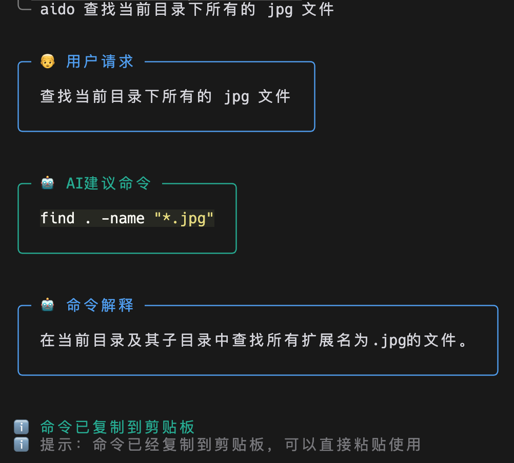
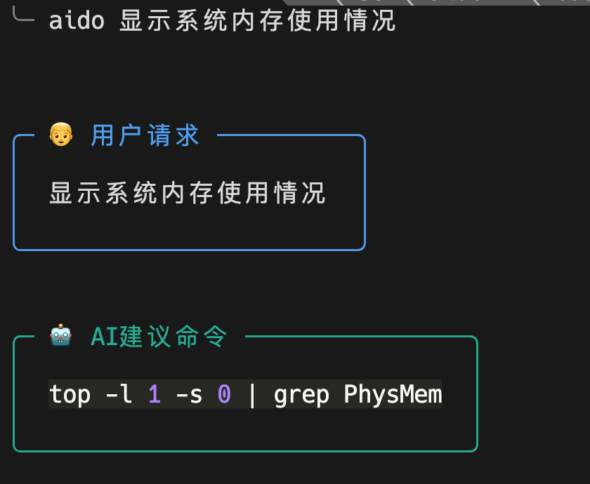
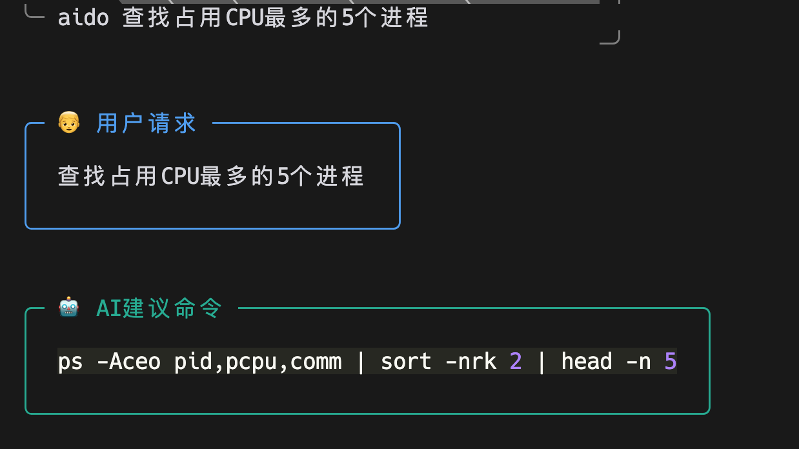
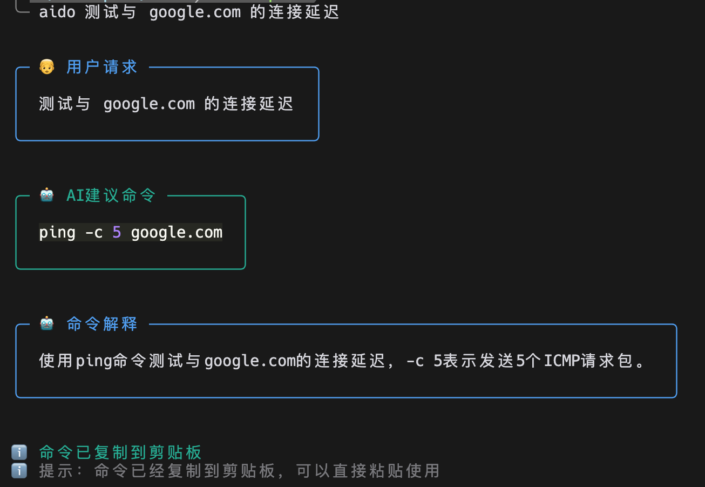

# AIDO - AI-Powered Command Line Assistant

AIDO 是一个基于 AI 的命令行助手，它可以将自然语言转换为命令行指令。

## 开发动机

在日常开发过程中，我们经常需要：
- 在浏览器中打开 AI 网站查询命令
- 在不同窗口间切换复制粘贴
- 重复查询一些常用但不容易记住的命令
- 部分灵感来自于 [《AI帮你赢：人人都能用的AI方法论》](https://book.douban.com/subject/37152637/)

AIDO 直接集成在终端中，让你可以：
- 直接在终端中用自然语言获取命令
- 自动复制命令到剪贴板
- 获取命令的中文解释
- 减少在不同窗口间切换的时间

## 安装方法

### 前置要求
- Python 3.8 或更高版本
- Git（用于克隆仓库）

### 一键安装（推荐）

#### MacOS/Linux
```bash
curl -fsSL https://raw.githubusercontent.com/zyjarge/aido/master/install_remote.sh | bash
```

#### Windows
```powershell
# 使用管理员权限运行 PowerShell
iwr -useb https://raw.githubusercontent.com/zyjarge/aido/master/install.bat -OutFile install.bat; .\install.bat
```

### 手动安装（从源码）

#### 1. 克隆仓库
```bash
git clone https://github.com/zyjarge/aido.git
cd aido
```

#### 2. 运行安装脚本

##### MacOS/Linux
```bash
./install.sh
```

##### Windows
```cmd
install.bat
```

安装脚本会自动完成以下操作：
- 检查 Python 环境
- 创建虚拟环境
- 安装所需依赖（使用清华大学镜像源加速）
- 创建配置文件
- 设置启动器

安装完成后，你需要：
1. 编辑 `.env.local` 文件，设置你的 `DEEPSEEK_API_KEY`
2. 现在可以在任何目录使用 `aido` 命令了

## 使用方法

1. 基本使用
```bash
# 查询命令
aido 统计当前目录下的文件数量
```



```bash
# 开启调试模式
aido --debug 查找所有大于100MB的文件
```



2. 示例

```bash
# 文件操作
aido 查找当前目录下所有的 jpg 文件
```



```bash
# 系统信息
aido 显示系统内存使用情况
```



```bash
# 进程管理
aido 查找占用CPU最多的5个进程
```



```bash
# 网络操作
aido 测试与 google.com 的连接延迟
```



3. 特点
- 命令会自动复制到剪贴板
- 提供命令的中文解释
- 支持复杂的命令组合
- 适配 MacOS/Linux/Windows 环境

## 配置说明

在 `.env.local` 文件中可以配置：
```bash
# DeepSeek API 密钥
DEEPSEEK_API_KEY=your_api_key_here

# 日志级别：DEBUG, INFO, WARNING, ERROR, CRITICAL
LOG_LEVEL=INFO
```
## 注意事项

1. 需要有效的 DeepSeek API key
2. 建议在执行命令前仔细检查 AI 生成的命令
3. 某些命令可能需要 root/管理员权限
4. Windows 环境下部分命令可能不适用

## 贡献

欢迎提交 Issue 和 Pull Request！

## 许可证

MIT License 
